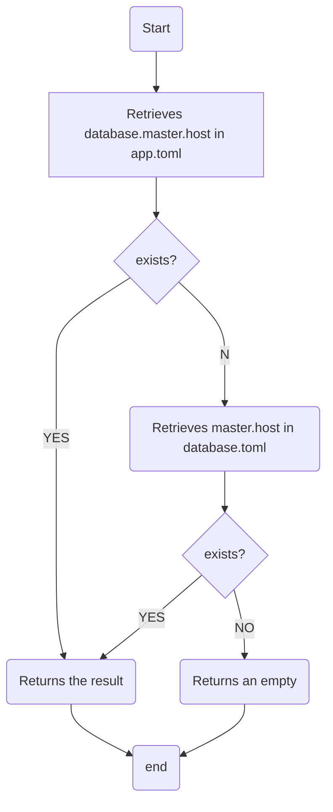

# tdog

   

Just start in a smaile.

## Contents

* [tdog](#tdog)
  * [Contents](#contents)
  * [About](#about)
  * [Installation](#installation)
  * [Quick start](#quick-start)
  * [Functions](#functions)
    * [1. MySQL Handler](#1-mysql-handler)
      * [1.1 Struct](#11-struct)
      * [1.2 NewMySQL() *mySql](#12-newmysql-mysql)
      * [1.3 (*mySql) Change(name string) *xorm.Engine](#13-mysql-changename-string-xormengine)
      * [1.4 (*mySql) New(name string, conf *MySqlConf) *xorm.Engine](#14-mysql-newname-string-conf-mysqlconf-xormengine)
      * [1.5 Example](#15-example)
    * [2. Redis Handler](#2-redis-handler)
        * [2.1 Struct](#21-struct-1)
        * [2.2 Functions and Usage](#22-functions-and-usage)
        * [2.2.1 NewRedis() *redisModel](#221-newredis-redismodel)
        * [2.2.2 (*redisModel) Change(name string) *redisImpl.Client](#222-redismodel-changename-string-redisimplclient)
        * [2.2.3 (*redisModel) New(name, host, port, pass string, poolSize int) *redisImpl.Client](#223-redismodel-newname-host-port-pass-string-poolsize-int-redisimplclient)
        * [2.2.4 (*redisModel) Db(index int) *redisImpl.Client](#224-redismodel-dbindex-int-redisimplclient)
      * [2.3 Example](#23-example)
    * [3. Util Handler](#3-util-handler)
      * [3.1 Struct](#31-struct)
      * [3.2 Functions and Usage](#32-functions-and-usage)
        * [3.2.1 NewUtil() *util](#321-newutil-util)
        * [3.2.2 (*util) GetFilesBySuffix(filePath string, suffix string) (files []string, err error)](#322-util-getfilesbysuffixfilepath-string-suffix-string-files-string-err-error)               
        * [3.2.3 (*util) FileExists(path string) bool](#323-util-fileexistspath-string-bool)
        * [3.2.4 (*util) IsDir(path string) bool](#324-util-isdirpath-string-bool)
        * [3.2.5 (*util) IsFile(path string)](#325-util-isfilepath-string)
        * [3.2.6 (*util) DirExistsAndCreate(path string)](#326-util-direxistsandcreatepath-string)
        * [3.2.7 (*util) RandomStr(length int, randType ...int) string](#327-util-randomstrlength-int-randtype-int-string)
        * [3.2.8 (*util) RandInt64(min, max int64) int64](#328-util-randint64min-max-int64-int64)
        * [3.2.9 (*util) InArray(dataType string, input, needle interface{}) bool](#329-util-inarraydatatype-string-input-needle-interface-bool)
        * [3.2.10 (*util) Isset(dataType string, input, needle interface{}) bool](#3210-util-issetdatatype-string-input-needle-interface-bool)
        * [3.2.11 (*util) Empty(dataType string, input, needle interface{}) bool](#3211-util-emptydatatype-string-input-needle-interface-bool)
        * [3.2.12 (*util) ArrayUnique(dataType string, input interface{}) interface{}](#3212-util-arrayuniquedatatype-string-input-interface-interface)
        * [3.2.13 (*util) ArrayMerge(dataType string, list ...interface{}) interface{}](#3213-util-arraymergedatatype-string-list-interface-interface)
        * [3.2.14 (*util) Remove(dataType string, slice interface{}, index int) interface{}](#3214-util-removedatatype-string-slice-interface-index-int-interface)
        * [3.2.15 (*util) VerifyEmail(email string) bool](#3215-util-verifyemailemail-string-bool)
        * [3.2.16 (*util) VerifyPhone(phone string) bool](#3216-util-verifyphonephone-string-bool)
        * [3.2.17 (*util) VerifyDate(input string) bool](#3217-util-verifydateinput-string-bool)
        * [3.2.18 (*util) VerifyDateTime(input string) bool](#3218-util-verifydatetimeinput-string-bool)
        * [3.2.19 (*util) GetMachineId() int64](#3219-util-getmachineid-int64)
        * [3.2.20 (*util) StructToMap(obj interface{}) map[string]interface{}](#3220-util-structtomapobj-interface-mapstringinterface)
        * [3.2.21 (*util) UrlSplit(url string) (protocol, domain string, port int)](#3221-util-urlspliturl-string-protocol-domain-string-port-int)
        * [3.2.22 (*util) UrlJoint(protocol, domain string, port int) (url string)](#3222-util-urljointprotocol-domain-string-port-int-url-string)
        * [3.2.23 (*util) SnakeString(s string) string](#3223-util-snakestrings-string-string)
        * [3.2.24 (*util) CamelString(s string) string](#3224-util-camelstrings-string-string)
        * [3.2.25 (*util) UcFirst(s string) string](#3225-util-ucfirsts-string-string)
        * [3.2.26 (*util) checkPortAlived(port int) bool](#3226-util-checkportalivedport-int-bool)
        * [3.2.26 (*util) GetPidByPort(port int) int](#3226-util-getpidbyportport-int-int)
        * [3.2.27 (*util) SetEnv(key interface{}, value string) error](#3227-util-setenvkey-interface-value-string-error)
        * [3.2.28 (*util) GetEnv(keys ...string) map[string]string](#3228-util-getenvkeys-string-mapstringstring)
        * [3.2.29 Recover()](#3229-recover)
        * [3.2.30 Monitor() (err error)](#3230-monitor-err-error)
      * [3.3 Example](#33-example)
    * [4. Crypt Handler](#4-crypt-handler)
      * [4.1 Struct](#41-struct)
      * [4.2 Functions and Usage](#42-functions-and-usage)
        * [4.2.1 NewCrypt(input string) *crypt](#421-newcryptinput-string-crypt)
        * [4.2.2 (*crypt) Md5() string](#422-crypt-md5-string)
        * [4.2.3 (*crypt) Sha1() string](#423-crypt-sha1-string)
        * [4.2.4 (*crypt) Sha256() string](#424-crypt-sha256-string)
        * [4.2.5 (*crypt) Sha512()](#425-crypt-sha512)
        * [4.2.6 (*crypt) Crc32() string](#426-crypt-crc32-string)
        * [4.2.7 (*crypt) Base64Encode() string](#427-crypt-base64encode-string)
        * [4.2.8 (*crypt) Base64Decode() string](#428-crypt-base64decode-string)
        * [4.2.9 (*crypt) UrlBase64Encode() string](#429-crypt-urlbase64encode-string)
        * [4.2.10 (*crypt) UrlBase64Decode() string](#4210-crypt-urlbase64decode-string)
        * [4.2.11 (*crypt) Urlencode() string](#4211-crypt-urlencode-string)
        * [4.2.12 (*crypt) Urldecode() string](#4212-crypt-urldecode-string)
        * [4.2.13 (*crypt) BiuPwdNewBuilder(password string) (salt string, newPassword string)](#4213-crypt-biupwdnewbuilderpassword-string-salt-string-newpassword-string)
        * [4.2.14 (*crypt) BiuPwdBuilder(salt string, password string) (newPassword string)](#4214-crypt-biupwdbuildersalt-string-password-string-newpassword-string)
        * [4.2.15 (*crypt) GenerateRsaKey(bits int) (publicKey, privateKey string)](#4215-crypt-generatersakeybits-int-publickey-privatekey-string)
        * [4.2.16 (*crypt) RsaPubEncode(pubKey string) string](#4216-crypt-rsapubencodepubkey-string-string)
        * [4.2.17 (*crypt) RsaPriDecode(priKey string) string](#4217-crypt-rsapridecodeprikey-string-string)
        * [4.2.18 (*crypt) RsaPriEncode(priKey string) string](#4218-crypt-rsapriencodeprikey-string-string)
        * [4.2.19 (*crypt) RsaPubDecode(pubKey string) string](#4219-crypt-rsapubdecodepubkey-string-string)
      * [4.3 Example](#43-example)
    * [5. Excel Handler](#5-excel-handler)
      * [5.1 Functions and Usage](#51-functions-and-usage)
        * [5.1.1 NewExcel(file string) *excel](#511-newexcelfile-string-excel)
        * [5.1.2 ( *excel) Get() [][][]string](#512--excel-get-string)
        * [5.1.3 (*excel) Open() (excelImpl *xlsx.File)](#513-excel-open-excelimpl-xlsxfile)
    * [6. Config Handler](#6-config-handler)
      * [6.1 Struct](#61-struct)
      * [6.2 Functions and Usage](#62-functions-and-usage)
        * [6.2.1 NewConfig() *config](#621-newconfig-config)
        * [6.2.2 (*config) SetPath(path string) *config](#622-config-setpathpath-string-config)
        * [6.2.3 (*config) SetFile(name string) *config](#623-config-setfilename-string-config)
        * [6.2.4 (*config) SetPrefix(prefix string) *config](#624-config-setprefixprefix-string-config)
        * [6.2.5 (*config) Get(key string) *configResult](#625-config-getkey-string-configresult)
        * [6.2.6 (*config) GetMulti(keys ...string) map[string]*configResult](#626-config-getmultikeys-string-mapstringconfigresult)
        * [6.2.7 (*configResult) GetSearchKey() string](#627-configresult-getsearchkey-string)
        * [6.2.8 (*configResult) IsExists() bool](#628-configresult-isexists-bool)
        * [6.2.9 (*configResult) RawData() (data interface{})](#629-configresult-rawdata-data-interface)
        * [6.2.10 (*configResult) ToString() (data string)](#6210-configresult-tostring-data-string)
        * [6.2.11 (*configResult) ToInt() (data int)](#6211-configresult-toint-data-int)
        * [6.2.12 (*configResult) ToBool() (data bool)](#6212-configresult-tobool-data-bool)
        * [6.2.13 (*configResult) ToIntSlice() (data []int)](#6213-configresult-tointslice-data-int)
        * [6.2.14 (*configResult) ToStringMap() (data map[string]interface{})](#6214-configresult-tostringmap-data-mapstringinterface)
        * [6.2.15 (*configResult) ToStringMapString() (data map[string]string)](#6215-configresult-tostringmapstring-data-mapstringstring)
        * [6.2.16 (*configResult) ToStringMapStringSlice() (data map[string][]string)](#6216-configresult-tostringmapstringslice-data-mapstringstring)
        * [6.2.17 (*configResult) ToStringSlice() (data []string)](#6217-configresult-tostringslice-data-string)
        * [6.2.18 (*configResult) ToInt64() (data int64)](#6218-configresult-toint64-data-int64)
      * [6.3 Example](#63-example)
    * [7. Logger Handler](#7-logger-handler)
      * [7.1 Struct](#71-struct)
      * [7.2 Functions and Usage](#72-functions-and-usage)
        * [7.2.1 NewLogger() *logger](#721-newlogger-logger)
        * [7.2.2 (*logger) Error(message string)](#722-logger-errormessage-string)
        * [7.2.3 (*logger) Warn(message string)](#723-logger-warnmessage-string)
        * [7.2.4 (*logger) Info(message string)](#724-logger-infomessage-string)
      * [7.3 Example](#73-example)
    * [8. Validation Handler](#8-validation-handler)
      * [8.1 Rule Struct](#81-rule-struct)
      * [8.2 Rule description](#82-rule-description)
      * [8.3 Functions and Usage](#83-functions-and-usage)
        * [8.3.1 NewValidate()](#831-newvalidate)
        * [8.3.2 (*validate) Rule(input []*rule) *validate](#832-validate-ruleinput-rule-validate)
        * [8.3.3 (*validate) Json(input string) *validate](#833-validate-jsoninput-string-validate)
        * [8.3.4 (*validate) Check(needle map[string]string) (output *validReport, err error)](#834-validate-checkneedle-mapstringstring-output-validreport-err-error)
        * [8.3.5 (*validate) UninterruptedCheck(needle map[string]string) (output *validReportCenter, err error)](#835-validate-uninterruptedcheckneedle-mapstringstring-output-validreportcenter-err-error)
      * [8.4 Validate Report Center and Validate Report](#84-validate-report-center-and-validate-report)
        * [8.4.1 Validate Report](#841-validate-report)
        * [8.4.2 Validate Report Center](#842-validate-report-center)
   * [Contributing](#contributing)
   * [Licence](#licence)
  <br />


## About

[中文文档](./README_CN.md)

Core for all my project of golang. It's sort of a framework, but I feel like it's actually a scaffolding.

The Restful-Server section is referred to GIN. It's not powerful, but it's relatively complete.

<br />


## Installation

To install Tdog package, you need to install Go and set your Go workspace first.

  1. Got it by go command:
  ```
    $ go get -u github.com/kisschou/tdog
  ```
  2. Import it in your code:
  ```
    import "github.com/kisschou/tdog"
  ```

<br />

## Quick start

#### Use it for server:

```
$ cat example.go
```

```go
package main

import (
    "net/http"

    "github.com/kisschou/tdog"
)

func main() {
    r := tdog.New()

    r.GET("/ping", func(httpUtil *tdog.HttpUtil) {
        httpUtil.Res.JSON(http.StatusOK, tdog.H{
            "message": "Pong GET",
        })
    })

    r.Run() // Start server.
}
```

#### Use it for scaffolding:

```go
package main

import (
    "github.com/kisschou/tdog"
)

func main() {
    id, err := tdog.NewSnowflake(1, 1, 1).Get()
    if err != nil {
        log.Fatalln(err)
    }
    log.Printf(id)
}
```

<br />

## Functions

Functions are at the heart of scaffolding.

<br />

#### 1. MySQL Handler

The [XORM](https://github.com/go-xorm/xorm) package is used, so the detailed functions can be referred to its [documentation](https://pkg.go.dev/github.com/go-xorm/xorm).

Here are just a few things I feel I need:

- Eliminating the need to write initialization over and over again when using the same configuration for the same library within a framework

- Made a simple link pool, automatic loading configuration initialization engine, improve the reusability

<br />

##### 1.1 Struct

```go
mySql struct {
	engineList map[string]*xorm.Engine // engine pool
	Engine     *xorm.Engine            // current engine
}

MySqlConf struct {
	engine       string
	Host         string
	Port         string
	User         string
	Pass         string
	Db           string
	Charset      string
	Prefix       string
	dsn          string
	Debug        bool
	MaxIdleConns int
	MaxOpenConns int
}
```
MySql configuration instructions:

| field        | type   | desc                                     |
| ------------ | ------ | ---------------------------------------- |
| engine       | string | Operating database engine.               |
| Host         | string | Database connection address.             |
| Port         | string | Database connection port.                |
| User         | string | Database connection account.             |
| Pass         | string | Database connection password.            |
| Db           | string | Database connection database.            |
| Charset      | string | Character set used by the database.      |
| Prefix       | string | The prefix of the table in the database. |
| dsn          | string | Data source name.                        |
| Debug        | bool   | Whether to enable debugging mode.        |
| MaxIdleConns | int    | The max idle connections on pool.        |
| MaxOpenConns | int    | The max open connections on pool.        |

> When you customize the MySQL configuration file, you only need to set the following values:
> - Host
> - Port
> - User
> - Pass
> - Db
> - Charset
> - Prefix
> - Debug
> - MaxIdleConns
> - MaxOpenConns

If you are importing a database connection from a configuration file, the configuration file will be styled using TOML. The configuration items are as follows:

```toml
$ cat database.toml
## Whether to enable debugging mode.
debug = true

# master
[master] # engine name
host = "127.0.0.1" # connection address
port = "3306" # connection port
user = "root" # connection account
pass = "root" # connection password
db = "test_db" # connection database
charset = "utf8mb4" # Character set used by the database
prefix = "" # The prefix of the table in the database

# db read only
[master_read] # engine name
host = "127.0.0.1" # connection address
port = "3306" # connection port
user = "root" # connection account
pass = "root" # connection password
db = "test_db" # connection database
charset = "utf8mb4" # Character set used by the database
prefix = "" # The prefix of the table in the database
```

> See the configuration section for how to get them from the toml file.

<br />

##### 1.2 NewMySQL() *mySql

This function is used to initialize the mySql structure, which is the starting point and the core of everything.

After import tdog, this function is used as `tdog.NewMySQL()`

<br />

##### 1.3 (*mySql) Change(name string) *xorm.Engine

Use the tag name to switch the current database engine.

If the tag name does not exist in the engine group, it will go to the configuration file to obtain the corresponding configuration, and then return to the engine after construction.

<br />

##### 1.4 (*mySql) New(name string, conf *MySqlConf) *xorm.Engine

You can use this function to generate an engine through a custom configuration file.

<br />

##### 1.5 Example

```go
import "github.com/kisschou/tdog"

engine := tdog.NewMySQL().Engine // init a mysql engine use default configuation.

tab1Impl := new(tab1) // init table struct.
result, err := engine.Where("id=?", 1).Get(tab1Impl)
// Query SQL: SELECT * FROM tab1 WHERE id = 1 LIMIT 1;

// About Transaction
trans := engine.Session() // init a new transaction.
defer trans.Close()
affected, err := trans.InsertMulti([]*tab1)
if affected < 1 && err != nil {
	trans.Rollback()
}
trans.Commit()
```

> For more orm operation methods, please refer to the [document](https://pkg.go.dev/github.com/go-xorm/xorm).

<br />

#### 2. Redis Handler

The [go-redis](https://github.com/go-redis/redis) package is used, so the detailed functions can be referred to its [documentation](https://pkg.go.dev/github.com/go-redis/redis/v8).

Here are just a few things I feel I need:

- Eliminating the need to write initialization over and over again when using the same configuration for the same library within a framework

- Made a simple link pool, automatic loading configuration initialization engine, improve the reusability

<br />

##### 2.1 Struct

```go
type redisModel struct {
	engineList map[string]*redisImpl.Client // Engine Pool
	Engine     *redisImpl.Client            // Current Engine
	db         int                          // Current Db
}
```

If you are importing a redis connection from a configuration file, the configuration file will be styled using TOML. The configuration items are as follows:

```toml
$ cat cache.toml
[master]
host = "127.0.0.1" # Connection address
port = "6379" # Connection port
pass = "" # Connection password
pool_size = 10 # Connection pool size
```

> See the configuration section for how to get them from the toml file.

<br />

##### 2.2 Functions and Usage

<br />

###### 2.2.1 NewRedis() *redisModel

This function is used to initialize the redisModel structure, which is the starting point and the core of everything.

After import tdog, this function is used as `tdog.NewRedis()`

<br />

###### 2.2.2 (*redisModel) Change(name string) *redisImpl.Client

Use the tag name to switch the current redis engine.

If the tag name does not exist in the engine group, it will go to the configuration file to obtain the corresponding configuration, and then return to the engine after construction.

<br />

###### 2.2.3 (*redisModel) New(name, host, port, pass string, poolSize int) *redisImpl.Client

You can use this function to generate an engine through a custom configuration file.

Passing parameter description:

| param    | type   | desc                           |
| -------- | ------ | ------------------------------ |
| name     | string | Set the connection name.       |
| host     | string | Set the connection host.       |
| port     | string | Set the connection port.       |
| pass     | string | Set the connection password.   |
| poolSize | int    | Sets the connection pool size. |

<br />

###### 2.2.4 (*redisModel) Db(index int) *redisImpl.Client

Accept an index to switch the libraries used by the current engine.

<br />

##### 2.3 Example

```go
import "github.com/kisschou/tdog"

engine := tdog.NewRedis().Engine // init a redis engine use default configuation.
result, err := engine.SetNX(tdog.Ctx, "test:key", "Hello World", time.Duration(60)*time.Second).Result() // Set key
engine.Get(tdog.Ctx, "test:key").String() // Get key
```

> For more orm operation methods, please refer to the [document](https://pkg.go.dev/github.com/go-xorm/xorm).

<br />

#### 3. Util Handler

Some scaffolding that I think is quite common. Currently as long as the implementation, not chasing too much performance, limited to strong typing, many places to write very cumbersome and incomplete support, the package will continue to improve, expand.

<br />

##### 3.1 Struct

There is nothing special about the structure.

<br />

##### 3.2 Functions and Usage

This is perhaps the duty of a scaffolding.

<br />

###### 3.2.1 NewUtil() *util

This function is used to initialize the util structure, which is the starting point and the core of everything.

After import tdog, this function is used as `tdog.NewUtil()`

<br />

###### 3.2.2 (*util) GetFilesBySuffix(filePath string, suffix string) (files []string, err error)

Gets the filename of all the specified suffixes from the specified path.

<br />

###### 3.2.3 (*util) FileExists(path string) bool

Check file is exists.

<br />

###### 3.2.4 (*util) IsDir(path string) bool

Check if it is a directory.

<br />

###### 3.2.5 (*util) IsFile(path string)

Check if it is a file.

<br />

###### 3.2.6 (*util) DirExistsAndCreate(path string)

Check if the directory exists, create it if it does not exist.

<br />

###### 3.2.7 (*util) RandomStr(length int, randType ...int) string

Generates a string of the specified type and length.

| param    | type   | description                                                  |
| -------- | ------ | ------------------------------------------------------------ |
| length   | int    | Specifies the length of the generated string                 |
| randType | ...int | Specify random type.Optional, multiple options, optional parameters: 1 to add a number 2 to add lowercase letters 3 to add capital letters, the default is 1. |

<br />

###### 3.2.8 (*util) RandInt64(min, max int64) int64

Specifies the range to generate a random number of type int64.

<br />

###### 3.2.9 (*util) InArray(dataType string, input, needle interface{}) bool

Determine whether a value exists in the array.

Parameter description:

- `dataType` : Identifying the type of needle, options:
  - []string
  - []int
  - []int64
  - map[string]string
  - map[string]int
  - map[string]int64
- `input` : Input value, this type is equal to the same type as the `value` of the `dataType`.
- `needle` : Retrieved set, this type is equal to `dataType`.

<br />

###### 3.2.10 (*util) Isset(dataType string, input, needle interface{}) bool

Determine if a key exists in the array.

Parameter description:

- `dataType` : Identifying the type of needle, options:
  - []string
  - []int
  - []int64
  - []interface{}
  - map[string]string
  - map[string]int
  - map[string]int64
  - map[string]interface{}
- `input` : Input value, this type is equal to the `dataType` of the same `key` type.
- `needle` : Retrieved set, this type is equal to `dataType`.

<br />

###### 3.2.11 (*util) Empty(dataType string, input, needle interface{}) bool

If the value of the key specified in the array is null, the number is greater than 0.

Parameter description:

- `dataType` : Identifying the type of needle, options:
  - []string
  - []int
  - []int64
  - map[string]string
  - map[string]int
  - map[string]int64
- `input` : Input value, this type is equal to the `dataType` of the same `key` type.
- `needle` : Retrieved set, this type is equal to `dataType`.

<br />

###### 3.2.12 (*util) ArrayUnique(dataType string, input interface{}) interface{}

Arrays remove duplicate keys.

Parameter description:

- `dataType` : Identifying the type of input, options:
  - []string
  - []int
  - []int64
  - []interface{}
  - map[string]string
  - map[string]int
  - map[string]int64
  - map[string]interface{}
- `input` : Arrays to process, this type is equal to `dataType`.

<br />

###### 3.2.13 (*util) ArrayMerge(dataType string, list ...interface{}) interface{}

Merge multiple arrays.

> Note that these arrays must be of the same type.

Parameter description:

- `dataType` : Identifying the type of list, options:
  - []string
  - []int
  - []interface{}
  - map[string]string
  - map[string]int
  - map[string]interface{}
- `list` : Two or more arrays of the same type.

<br />

###### 3.2.14 (*util) Remove(dataType string, slice interface{}, index int) interface{}

This function is written because in Go it seems that only map removes the specified key, not slice removes the specified index.

Parameter description:

- `dataType` : Identifying the type of slice, options:
  - []string
  - []int
  - []int64
  - []interface{}
- `slice` : The section to be processed, this type is equal to `dataType`.
- `index` : The index to drop.

<br />

###### 3.2.15 (*util) VerifyEmail(email string) bool

Verify that the mailbox format is correct.

<br />

###### 3.2.16 (*util) VerifyPhone(phone string) bool

Verify that the format of the phone number is correct.

> For the time being, it only supports mobile phone number verification in mainland China.

<br />

###### 3.2.17 (*util) VerifyDate(input string) bool

Verify that the date format is correct. Format: YYYY-MM-DD.

<br />

###### 3.2.18 (*util) VerifyDateTime(input string) bool

Verify that the date and time format is correct. Format: YYYY-MM-DD HH:mm:ss.

<br />

###### 3.2.19 (*util) GetMachineId() int64

Get the device number and generate it through the network card IPv4.

<br />

###### 3.2.20 (*util) StructToMap(obj interface{}) map[string]interface{}

Structure is converted to MAP.

Because of some unknown problems, often lead to panic, so joined recover(), although recovered, but still did not convert successfully.

It's a function that needs further refinement.

<br />

###### 3.2.21 (*util) UrlSplit(url string) (protocol, domain string, port int)

Url decomposition.

<br />

###### 3.2.22 (*util) UrlJoint(protocol, domain string, port int) (url string)

Url stitching.

<br />

###### 3.2.23 (*util) SnakeString(s string) string

The hump turns into a snake.

<br />

###### 3.2.24 (*util) CamelString(s string) string

The shape of a snake turns to a hump.

<br />

###### 3.2.25 (*util) UcFirst(s string) string

Capitalize the first letter.

<br />

###### 3.2.26 (*util) checkPortAlived(port int) bool

Check if the port is already occupied.

<br />

###### 3.2.26 (*util) GetPidByPort(port int) int

Get the PID from the port number.

> It is not always available. For example, coroutines are not available.

<br />

###### 3.2.27 (*util) SetEnv(key interface{}, value string) error

Writes the specified key value to the environment variable.

Parameter description:

- `key` : The key name can only be String or Map [String] String.
  - if `string` : Corresponds to the value passed in as the key value.
  - if `map[string]string` : Ignore the value passed in and set the key values in the map in bulk.

- `value` : The corresponding value, which can be `empty` when the key is map.

<br />

###### 3.2.28 (*util) GetEnv(keys ...string) map[string]string

Gets one or more key values from an environment variable. 

So the input can be one or more, and the map returned corresponds to the input key, and the value corresponds to the value retrieved by the response.

<br />

###### 3.2.29 Recover()

Get out of the panic and write down the cause of the panic in your log.

Usually use `defer`.

<br />

###### 3.2.30 Monitor() (err error)

Basic check, check whether Redis and MySQL can connect etc.

It is common to run through the script where it was started to make sure that the running script does not have an error somewhere due to this additional problem.

<br />

##### 3.3 Example

All functions are available directly after NewUtil.

```go
import "github.com/kisschou/tdog"

util := tdog.NewUtil()
res := util.RandomStr(10, 1, 2)
```

<br />

#### 4. Crypt Handler

In fact, the encapsulation is some simple encryption, but sometimes use it can not remember how to write, scaffolding is the key to easy to use.

<br />

##### 4.1 Struct

There is nothing in the structure that needs to be introduced.

<br />

##### 4.2 Functions and Usage

These are all encryption methods that I still find quite common.

<br />

###### 4.2.1 NewCrypt(input string) *crypt

This function is used to initialize the crypt structure, which is the starting point and the core of everything.

After import tdog, this function is used as `tdog.NewCrypt("a string to encrypt")`

<br />

###### 4.2.2 (*crypt) Md5() string

Returns the MD5 encrypted string.

<br />

###### 4.2.3 (*crypt) Sha1() string

Returns the SHA1 encrypted string.

<br />

###### 4.2.4 (*crypt) Sha256() string

Returns the SHA256 encrypted string.

<br />

###### 4.2.5 (*crypt) Sha512()

Returns the SHA512 encrypted string.

<br />

###### 4.2.6 (*crypt) Crc32() string

Returns the results processed through Cyclic Redundancy Check 32.

<br />

###### 4.2.7 (*crypt) Base64Encode() string

Base64 encrypts the data and returns the encryption result.

<br />

###### 4.2.8 (*crypt) Base64Decode() string

Returns data decrypted in Base64.

<br />

###### 4.2.9 (*crypt) UrlBase64Encode() string

UrlBase64 encrypts the data and returns the encryption result.

<br />

###### 4.2.10 (*crypt) UrlBase64Decode() string

Returns data decrypted in UrlBase64.

<br />

###### 4.2.11 (*crypt) Urlencode() string

Urlencode encrypts the data and returns the encryption result.

<br />

###### 4.2.12 (*crypt) Urldecode() string

Returns data decrypted in Urldecode.

<br />

###### 4.2.13 (*crypt) BiuPwdNewBuilder(password string) (salt string, newPassword string)

The original encryption scheme used by a project called Biushop encrypts incoming data using random salt, fixed salt, MD5, and SHA512, and returns the random salt used for encryption and the encryption result. The decryption result is irreversible.

<br />

###### 4.2.14 (*crypt) BiuPwdBuilder(salt string, password string) (newPassword string)

This is a complement to Biushop, because I'm not used to Golang's support for optional parameters, and I'm a bit obsessive about the order of the parameters.

This method is mainly through the incoming encryption data and random salt, to generate the encrypted results.

<br />

###### 4.2.15 (*crypt) GenerateRsaKey(bits int) (publicKey, privateKey string)

Receive an int to determine the number of bits of the generated RSA key, and return the generated public and private keys.

<br />

###### 4.2.16 (*crypt) RsaPubEncode(pubKey string) string

Receive the incoming public key and use it to RSA encrypt the data.

<br />

###### 4.2.17 (*crypt) RsaPriDecode(priKey string) string

Receive the incoming private key and use it to RSA decrypt the data.

<br />

###### 4.2.18 (*crypt) RsaPriEncode(priKey string) string

Receive the incoming private key and use it to RSA encrypt the data.

<br />

###### 4.2.19 (*crypt) RsaPubDecode(pubKey string) string

Receive the incoming public key and use it to RSA decrypt the data.

<br />

##### 4.3 Example

```go
import "github.com/kisschou/tdog"

// md5
encrypt := tdog.NewCrypt("inputStr").Md5()

// RSA
crypt := tdog.NewCrypt("inputStr")
publicKey, privateKey := crypt.GenerateRsaKey(20)
encrypt := crypt.RsaPubEncode(publicKey)
decrypt := tdog.NewCrypt(encrypt).RsaPriDecode(privateKey)

encrypt = tdog.NewCrypt(decrypt).RsaPriEncode(privateKey)
decrypt = tdog.NewCrypt(encrypt).RsaPubDecode(publicKey)
```

<br />

#### 5. Excel Handler

The use of [XLSX](https://github.com/tealeg/xlsx) package to do a convenient use of Excel processing tools, because do not know how to face the Excel processing, so just do a simple function.

<br />

##### 5.1 Functions and Usage

<br />

###### 5.1.1 NewExcel(file string) *excel

Initialize an Excel module with the file, which is the starting point and the core of everything.

Note: that the file passed in here must contain the path.

<br />

###### 5.1.2 ( *excel) Get() \[\]\[\]\[\]string

Read all the data out of the file and return it.

<br />

###### 5.1.3 (*excel) Open() (excelImpl *xlsx.File)

Return to the operation controller of Excel file, refer to the detailed tutorial of XLSX for the specific operation functions.

<br />

#### 6. Config Handler

This is a configuration file acquisition tool packaged with [viper](https://github.com/spf13/viper). The reasons for encapsulation are:

  - The configuration file of a project is theoretically of the same type and exists in a directory, so it can be used to preset the basic information, eliminating the trouble of manually setting the path and file name each time it is used.

  - The configuration may not be stored in the same configuration file. In order to eliminate the need for cross-file query, the problem of rebuilding the engine based on the file.

  - Support query and output of multiple configurations under one or more files.

<br />

##### 6.1 Struct

The configuration file writing needs to meet the toml configuration file writing requirements, and multiple configuration files can be made in one directory.

Basic Configuration files `app.toml`, it does not have to exist, but it is the first query file.

```shell
$ tree ./config

config/
├── app.toml
├── cache.toml
├── database.toml
├── error.toml
└── ...

$ cat app.toml

# product'name string
app_name = "ServiceCenter"

# service's port string
app_port = "8002"
```

<br />

##### 6.2 Functions and Usage

First, have to specify the configuration of the configuration file to env at the intersection. This can use the `SetEnv` function under the `Util` module:

```go
import "github.com/kisschou/tdog"

tdog.NewUtil().SetEnv("CONFIG_PATH", "/path/to/config/")
```

<br />

###### 6.2.1 NewConfig() *config

Initialize an `config` module with the file, which is the starting point and the core of everything.

<br />

###### 6.2.2 (*config) SetPath(path string) *config

If the configuration file you are querying is not in the preset path, you can use this function to temporarily modify the query path.

<br />

###### 6.2.3 (*config) SetFile(name string) *config

Specify the query configuration file, that is, only look for the configuration in this configuration file.

Generally use the same file batch query and the same name configuration item query.

<br />

###### 6.2.4 (*config) SetPrefix(prefix string) *config

Set the prefix of the query item. Generally used for batch query of multiple configuration items in the same place.

<br />

###### 6.2.5 (*config) Get(key string) *configResult

For example, to execute `Get("database.masetr.host")`, flow of execution is:



<br />

###### 6.2.6 (*config) GetMulti(keys ...string) map[string]*configResult

Start batch query.

<br />

###### 6.2.7 (*configResult) GetSearchKey() string

Get the key used by the result query from the result set.

<br />

###### 6.2.8 (*configResult) IsExists() bool

Whether to find the result.

<br />

###### 6.2.9 (*configResult) RawData() (data interface{})

Get the result of interface{} type.

<br />

###### 6.2.10 (*configResult) ToString() (data string)

Get the result of string type.

<br />

###### 6.2.11 (*configResult) ToInt() (data int)

Get the result of int type.

<br />

###### 6.2.12 (*configResult) ToBool() (data bool)

Get the result of bool type.

<br />

###### 6.2.13 (*configResult) ToIntSlice() (data []int)

Get the result of int slice type.

<br />

###### 6.2.14 (*configResult) ToStringMap() (data map[string]interface{})

Get the result of string map type.

<br />

###### 6.2.15 (*configResult) ToStringMapString() (data map[string]string)

Get the result of string map string type.

<br />

###### 6.2.16 (*configResult) ToStringMapStringSlice() (data map\[string\]\[\]string)

Get the result of string map string slice type.

<br />

###### 6.2.17 (*configResult) ToStringSlice() (data []string)

Get the result of string slice type.

<br />

###### 6.2.18 (*configResult) ToInt64() (data int64)

Get the result of int64 type.

<br />

##### 6.3 Example

```go
import "github.com/kisschou/tdog"

tdog.NewUtil().SetEnv("CONFIG_PATH", "/path/to/config/")

// Get
tdog.NewConfig().Get("app_port").ToString() // app.toml => app_port
tdog.NewConfig().Get("database.master.port").RawData().(string) // database.toml => [master] port

// GetMulti
resultImpls := NewConfig().GetMulti("app_port", "database.master.port", "cache.port")
for _, resultImpl := range resultImpls {
	fmt.Println(resultImpl.GetSearchKey(), resultImpl.IsExists(), resultImpl.ToString())
}

resultImpls =  NewConfig().SetFile("cache").SetPrefix("master.").GetMulti("host", "port", "pass", "pool_size")
var host, port, pass string
var poolSize int
for _, resultImpl := range resultImpls {
	switch resultImpl.GetSearchKey() {
	case "host":
		host = resultImpl.ToString()
		break
	case "port":
		port = resultImpl.ToString()
		break
	case "pass":
		pass = resultImpl.RawData().(string)
		break
	case "pool_size":
		poolSize = resultImpl.ToInt()
		break
	}
}
```

Please feel free to explore more.

<br />

#### 7. Logger Handler

This is the logging module. The idea of replacing ELK with Uber's ZAP was originally ignited.

The queue uses Redis, so you should configure the connection parameters for Redis first.

<br />

##### 7.1 Struct

The model structure is so simplistic that there doesn't seem to be much to say.

<br />

##### 7.2 Functions and Usage

The logs are all written to a specified key in Redis. The default key is `log:list`.

<br />

###### 7.2.1 NewLogger() *logger

This function is used to initialize the logger structure, which is the starting point and the core of everything.

After import tdog, this function is used as `tdog.NewLogger()`

<br />

###### 7.2.2 (*logger) Error(message string)

Writes an error message to the log list.

<br />

###### 7.2.3 (*logger) Warn(message string)

Writes a warning message to the log list.

<br />

###### 7.2.4 (*logger) Info(message string)

Writes a message to the log list.

<br />

##### 7.3 Example

```go
import "github.com/kisschou/tdog"

tdog.NewLogger().Error("This is a error message!")
tdog.NewLogger().Warn("This is a warn message!")
tdog.NewLogger().Info("This is a info message!")

# Asynchronous processing is recommended
go tdog.NewLogger().Error("This is a error message!")
```

I will add key modifications to it in the future.

<br />

#### 8. Validation Handler

This is a parameter automatic validation module.

In a set of rules, fast, convenient, automatic calibration of the corresponding fields according to the rules, and feedback calibration results.

So, rules are important.

<br />

##### 8.1 Rule Struct

```go
Rule struct {
	Name      string   `json:"name"`     // key's name
	ParamType string   `json:"type"`     // val's type
	IsMust    bool     `json:"is_must"`  // is must be set
	Rule      []string `json:"validate"` // vaildate rule
}
```

| field     | type     | desc                                                                          |
| --------- | -------- | ----------------------------------------------------------------------------- |
| Name      | string   | The key name of the query in the parameter list.                              |
| ParamType | string   | The type of value to be queried in the parameter list.                        |
| IsMust    | bool     | Specifies that the key name must exist in the parameter list.                 |
| Rule      | []string | The validation rules used can be found in the Rule Description section below. |

> `IsMust` takes precedence over all rules. All rules take precedence and are executed in the specified order.

<br />

##### 8.2 Rule description

| keyword             | description                                                                                                               | example           |
| ------------------- | ------------------------------------------------------------------------------------------------------------------------- | ----------------- |
| empty               | Determine if the value is empty.If it's a number, it determines if it's greater than 0.                                   | -                 |
| phone               | Determine whether the content of the value is a phone number. Currently, only Chinese mobile phone numbers are supported. | -                 |
| email               | Determine whether the contents of the value are mailbox addresses.                                                        | -                 |
| scope(x, y)         | Set a range to specify a reasonable length for a string or number.                                                        | scope(1,10)       |
| enum(str1,str2,...) | Set an enumeration to constrain the contents of the value.                                                                | enum(header,body) |
| date                | Determine whether the value conforms to the date format, which is yyyy-mm-dd.                                             | -                 |
| datetime            | Check whether the value conforms to the date and time format, which is: yyyy-mm-dd HH: MM :ss.                            | -                 |
| sensitive-word      | The desensitized word list retrieves whether the content contains sensitive words. This item is temporarily invalid.      | -                 |

> You can select multiple rules to constrain a field at the same time, such as' []string{" empty ", 'email', 'scope(10,)'} 'to specify a value that also satisfies:
> · Can't be empty
> · Is the correct email address
> · Length greater than 10

> The scope(x,y) rule can set both x and y values, or only one of them. When you set the value of x, you're adding a condition that's greater than x, and the same thing for the value of y, when you set it, you're adding a condition that's less than y.

<br />

##### 8.3 Functions and Usage

In fact, what is said here is some obvious things, but afraid of a long time, they have forgotten, so record.

<br />

###### 8.3.1 NewValidate()

This function is used to initialize the validate structure, which is the starting point and the core of everything.

After import tdog, this function is used as `tdog.NewValidate()`

<br />

###### 8.3.2 (*validate) Rule(input []\*rule) *validate

This function is mainly used to inject a list of rules. The list of rules is derived from the `Rule Struct`.

<br />

###### 8.3.3 (*validate) Json(input string) *validate

This Function is also used to inject a list of rules, the difference is that the parameter passed to this function is `json`. If used in conjunction with the `Rule Function`, the latter will override the former.

<br />

###### 8.3.4 (*validate) Check(needle map[string]string) (output *validReport, err error)

Begin validation and return the `validation report structure` as soon as any data fails.

The received parameter is `map[string]string`. This is the collection of uplink data. If multidimensional array is involved, it needs to build its own loop processing.

What is returned is a structure of the `Validate report` and an `error interface`. Errors need to be handled by your own judgment. This is an old thing in golang. The use of the structure of the `Validate report` can be viewed in more detail below.

<br />


###### 8.3.5 (*validate) UninterruptedCheck(needle map[string]string) (output *validReportCenter, err error)

Start the Validate, regardless of whether it encounters an object that has an error, it will stubbornly insist on running all the data.

The received parameter is `map[string]string`. This is the collection of uplink data. If multidimensional array is involved, it needs to build its own loop processing.

It will pack all the Validate reports into the `Validate report center` and return. The detailed description of the calibration report center will look down. It also returns an `error interface` that needs to be handled by itself.

<br />


##### 8.4 Validate Report Center and Validate Report

The processing related to the Validate report cannot escape these two little guys.

<br />

###### 8.4.1 Validate Report

This structure has no sub-functions, but it has some parameters that can be used:

| param   | type        | desc                                                                                                                                                                                         |
| ------- | ----------- | -------------------------------------------------------------------------------------------------------------------------------------------------------------------------------------------- |
| Name    | string      | The key name of the query in the parameter list.                                                                                                                                             |
| Rule    | []string    | The validation rules used can be found in the Rule Description section below.                                                                                                                |
| Result  | bool        | The result of the verification, `True` means the verification is successful, `False` means the verification failed                                                                           |
| Message | string      | The text message feedback of the verification result is currently only fixed in Chinese, and customization is not supported. If necessary, you can handle it yourself according by `Result`. |
| Val     | interface{} | Gets the associated value. The type is the same as `ParamsType`.                                                                                                                             |

> You can use these parameters directly.
>
> If after a round of inspection and found that all have passed the verification, a report structure will be returned at this time, its Name and Rule are empty, Result is True, and Message is Success.
> So if you see a similar validate report, This can continue the following process.

<br />

###### 8.4.2 Validate Report Center

- (*validReportCenter) ReportList() []*validReport 

  > get all report from report center.

- (*validReportCenter) ReportByIndex(index int) *validReport

  > get the report by index. so given int index, returns `*report`.

- (*validReportCenter) ReportByName(name string) *validReport

  > get the report by name. so must given string name, and will returns `*report`

- (rc *validReportCenter) CheckSuccess(inputs ...string) (isAllSuccess bool, failList []*validReport)

  > Receive the incoming parameters, determine whether all have passed the verification, if not, return the set that has not passed the verification.

- (*validReportCenter) BuildTime() string

  > get build time from report center.

- (*validReportCenter) ElapsedTime() int64

  > get elapsed time from report center. The return value is nanoseconds.

- (*validReportCenter) ToJson() string

  > convert to json and return.

  <br />


## Contributing

Let's have a good time together!!!

- Fork the Project
- Create your Feature Branch (git checkout -b feature/AmazingFeature)
- Commit your Changes (git commit -m 'Add some AmazingFeature')
- Push to the Branch (git push origin feature/AmazingFeature)
- Open a Pull Request

<br />


## Licence

Copyright (c) 2020-present Kisschou.
