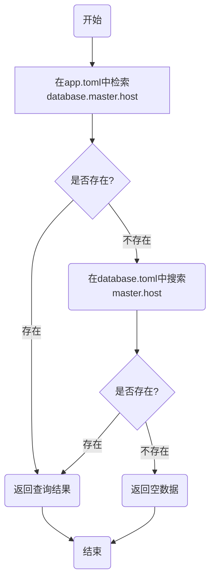

# tdog

   

仅仅是一个微笑的开始.

## 内容

* [tdog](#tdog)
  * [内容](#内容)
  * [介绍](#介绍)
  * [安装](#安装)
  * [快速使用](#快速使用)
  * [函数们](#函数们)
    * [1. MySQL](#1-mysql)
      * [1.1 结构](#11-结构)
      * [1.2 NewMySQL() *mySql](#12-newmysql-mysql)
      * [1.3 (*mySql) Change(name string) *xorm.Engine](#13-mysql-changename-string-xormengine)
      * [1.4 (*mySql) New(name string, conf *MySqlConf) *xorm.Engine](#14-mysql-newname-string-conf-mysqlconf-xormengine)
      * [1.5 示例](#15-示例)
    * [2. Redis](#2-redis)
      * [2.1 结构](#21-结构)
      * [2.2 函数和使用](#22-函数和使用)
      * [2.2.1 NewRedis() *redisModel](#221-newredis-redismodel)
      * [2.2.2 (*redisModel) Change(name string) *redisImpl.Client](#222-redismodel-changename-string-redisimplclient)
      * [2.2.3 (*redisModel) New(name, host, port, pass string, poolSize int) *redisImpl.Client](#223-redismodel-newname-host-port-pass-string-poolsize-int-redisimplclient)
      * [2.2.4 (*redisModel) Db(index int) *redisImpl.Client](#124-redismodel-dbindex-int-redisimplclient)
      * [2.3 示例](#23-示例)
    * [3. 功能](#3-功能)
      * [3.1 结构](#31-结构)
      * [3.2 函数和使用](#32-函数和使用)
        * [3.2.1 NewUtil() *util](#321-newutil-util)
        * [3.2.2 (*util) GetFilesBySuffix(filePath string, suffix string) (files []string, err error)](#322-util-getfilesbysuffixfilepath-string-suffix-string-files-string-err-error)               
        * [3.2.3 (*util) FileExists(path string) bool](#323-util-fileexistspath-string-bool)
        * [3.2.4 (*util) IsDir(path string) bool](#324-util-isdirpath-string-bool)
        * [3.2.5 (*util) IsFile(path string)](#325-util-isfilepath-string)
        * [3.2.6 (*util) DirExistsAndCreate(path string)](#326-util-direxistsandcreatepath-string)
        * [3.2.7 (*util) RandomStr(length int, randType ...int) string](#327-util-randomstrlength-int-randtype-int-string)
        * [3.2.8 (*util) RandInt64(min, max int64) int64](#328-util-randint64min-max-int64-int64)
        * [3.2.9 (*util) InArray(dataType string, input, needle interface{}) bool](#329-util-inarraydatatype-string-input-needle-interface-bool)
        * [3.2.10 (*util) Isset(dataType string, input, needle interface{}) bool](#3210-util-issetdatatype-string-input-needle-interface-bool)
        * [3.2.11 (*util) Empty(dataType string, input, needle interface{}) bool](#3211-util-emptydatatype-string-input-needle-interface-bool)
        * [3.2.12 (*util) ArrayUnique(dataType string, input interface{}) interface{}](#3212-util-arrayuniquedatatype-string-input-interface-interface)
        * [3.2.13 (*util) ArrayMerge(dataType string, list ...interface{}) interface{}](#3213-util-arraymergedatatype-string-list-interface-interface)
        * [3.2.14 (*util) Remove(dataType string, slice interface{}, index int) interface{}](#3214-util-removedatatype-string-slice-interface-index-int-interface)
        * [3.2.15 (*util) VerifyEmail(email string) bool](#3215-util-verifyemailemail-string-bool)
        * [3.2.16 (*util) VerifyPhone(phone string) bool](#3216-util-verifyphonephone-string-bool)
        * [3.2.17 (*util) VerifyDate(input string) bool](#3217-util-verifydateinput-string-bool)
        * [3.2.18 (*util) VerifyDateTime(input string) bool](#3218-util-verifydatetimeinput-string-bool)
        * [3.2.19 (*util) GetMachineId() int64](#3219-util-getmachineid-int64)
        * [3.2.20 (*util) StructToMap(obj interface{}) map[string]interface{}](#3220-util-structtomapobj-interface-mapstringinterface)
        * [3.2.21 (*util) UrlSplit(url string) (protocol, domain string, port int)](#3221-util-urlspliturl-string-protocol-domain-string-port-int)
        * [3.2.22 (*util) UrlJoint(protocol, domain string, port int) (url string)](#3222-util-urljointprotocol-domain-string-port-int-url-string)
        * [3.2.23 (*util) SnakeString(s string) string](#3223-util-snakestrings-string-string)
        * [3.2.24 (*util) CamelString(s string) string](#3224-util-camelstrings-string-string)
        * [3.2.25 (*util) UcFirst(s string) string](#3225-util-ucfirsts-string-string)
        * [3.2.26 (*util) checkPortAlived(port int) bool](#3226-util-checkportalivedport-int-bool)
        * [3.2.26 (*util) GetPidByPort(port int) int](#3226-util-getpidbyportport-int-int)
        * [3.2.27 (*util) SetEnv(key interface{}, value string) error](#3227-util-setenvkey-interface-value-string-error)
        * [3.2.28 (*util) GetEnv(keys ...string) map[string]string](#3228-util-getenvkeys-string-mapstringstring)
        * [3.2.29 Recover()](#3229-recover)
        * [3.2.30 Monitor() (err error)](#3230-monitor-err-error)
      * [3.3 示例](#33-示例)
    * [4. 加密](#4-加密)
      * [4.1 结构](#41-结构)
      * [4.2 函数和使用](#42-函数和使用)
        * [4.2.1 NewCrypt(input string) *crypt](#421-newcryptinput-string-crypt)
        * [4.2.2 (*crypt) Md5() string](#422-crypt-md5-string)
        * [4.2.3 (*crypt) Sha1() string](#423-crypt-sha1-string)
        * [4.2.4 (*crypt) Sha256() string](#424-crypt-sha256-string)
        * [4.2.5 (*crypt) Sha512()](#425-crypt-sha512)
        * [4.2.6 (*crypt) Crc32() string](#426-crypt-crc32-string)
        * [4.2.7 (*crypt) Base64Encode() string](#427-crypt-base64encode-string)
        * [4.2.8 (*crypt) Base64Decode() string](#428-crypt-base64decode-string)
        * [4.2.9 (*crypt) UrlBase64Encode() string](#429-crypt-urlbase64encode-string)
        * [4.2.10 (*crypt) UrlBase64Decode() string](#4210-crypt-urlbase64decode-string)
        * [4.2.11 (*crypt) Urlencode() string](#4211-crypt-urlencode-string)
        * [4.2.12 (*crypt) Urldecode() string](#4212-crypt-urldecode-string)
        * [4.2.13 (*crypt) BiuPwdNewBuilder(password string) (salt string, newPassword string)](#4213-crypt-biupwdnewbuilderpassword-string-salt-string-newpassword-string)
        * [4.2.14 (*crypt) BiuPwdBuilder(salt string, password string) (newPassword string)](#4214-crypt-biupwdbuildersalt-string-password-string-newpassword-string)
        * [4.2.15 (*crypt) GenerateRsaKey(bits int) (publicKey, privateKey string)](#4215-crypt-generatersakeybits-int-publickey-privatekey-string)
        * [4.2.16 (*crypt) RsaPubEncode(pubKey string) string](#4216-crypt-rsapubencodepubkey-string-string)
        * [4.2.17 (*crypt) RsaPriDecode(priKey string) string](#4217-crypt-rsapridecodeprikey-string-string)
        * [4.2.18 (*crypt) RsaPriEncode(priKey string) string](#4218-crypt-rsapriencodeprikey-string-string)
        * [4.2.19 (*crypt) RsaPubDecode(pubKey string) string](#4219-crypt-rsapubdecodepubkey-string-string)
      * [4.3 示例](#43-示例)
    * [5. Excel](#5-excel)
      * [5.1 函数和使用](#51-函数和使用)
        * [5.1.1 NewExcel(file string) *excel](#511-newexcelfile-string-excel)
        * [5.1.2 ( *excel) Get() [][][]string](#512--excel-get-string)
        * [5.1.3 (*excel) Open() (excelImpl *xlsx.File)](#513-excel-open-excelimpl-xlsxfile)
    * [6. 配置](#6-配置)
      * [6.1 结构](#61-结构)
      * [6.2 函数和使用](#62-函数和使用)
        * [6.2.1 NewConfig() *config](#621-newconfig-config)
        * [6.2.2 (*config) SetPath(path string) *config](#622-config-setpathpath-string-config)
        * [6.2.3 (*config) SetFile(name string) *config](#623-config-setfilename-string-config)
        * [6.2.4 (*config) SetPrefix(prefix string) *config](#624-config-setprefixprefix-string-config)
        * [6.2.5 (*config) Get(key string) *configResult](#625-config-getkey-string-configresult)
        * [6.2.6 (*config) GetMulti(keys ...string) map[string]*configResult](#626-config-getmultikeys-string-mapstringconfigresult)
        * [6.2.7 (*configResult) GetSearchKey() string](#627-configresult-getsearchkey-string)
        * [6.2.8 (*configResult) IsExists() bool](#628-configresult-isexists-bool)
        * [6.2.9 (*configResult) RawData() (data interface{})](#629-configresult-rawdata-data-interface)
        * [6.2.10 (*configResult) ToString() (data string)](#6210-configresult-tostring-data-string)
        * [6.2.11 (*configResult) ToInt() (data int)](#6211-configresult-toint-data-int)
        * [6.2.12 (*configResult) ToBool() (data bool)](#6212-configresult-tobool-data-bool)
        * [6.2.13 (*configResult) ToIntSlice() (data []int)](#6213-configresult-tointslice-data-int)
        * [6.2.14 (*configResult) ToStringMap() (data map[string]interface{})](#6214-configresult-tostringmap-data-mapstringinterface)
        * [6.2.15 (*configResult) ToStringMapString() (data map[string]string)](#6215-configresult-tostringmapstring-data-mapstringstring)
        * [6.2.16 (*configResult) ToStringMapStringSlice() (data map[string][]string)](#6216-configresult-tostringmapstringslice-data-mapstringstring)
        * [6.2.17 (*configResult) ToStringSlice() (data []string)](#6217-configresult-tostringslice-data-string)
        * [6.2.18 (*configResult) ToInt64() (data int64)](#6218-configresult-toint64-data-int64)
      * [6.3 示例](#63-示例)
    * [7. 日志](#7-日志)
      * [7.1 结构](#71-结构)
      * [7.2 函数和使用](#72-函数和使用)
        * [7.2.1 NewLogger() *logger](#721-newlogger-logger)
        * [7.2.2 (*logger) Error(message string)](#722-logger-errormessage-string)
        * [7.2.3 (*logger) Warn(message string)](#723-logger-warnmessage-string)
        * [7.2.4 (*logger) Info(message string)](#724-logger-infomessage-string)
      * [7.3 示例](#73-示例)
    * [8. 自动验证](#8-自动验证)
      * [8.1 结构](#81-结构)
      * [8.2 规则描述](#82-规则描述)
      * [8.3 函数和使用](#83-函数和使用)
        * [8.3.1 NewValidate()](#831-newvalidate)
        * [8.3.2 (*validate) Rule(input []*rule) *validate](#832-validate-ruleinput-rule-validate)
        * [8.3.3 (*validate) Json(input string) *validate](#833-validate-jsoninput-string-validate)
        * [8.3.4 (*validate) Check(needle map[string]string) (output *validReport, err error)](#834-validate-checkneedle-mapstringstring-output-validreport-err-error)
        * [8.3.5 (*validate) UninterruptedCheck(needle map[string]string) (output *validReportCenter, err error)](#835-validate-uninterruptedcheckneedle-mapstringstring-output-validreportcenter-err-error)
      * [8.4 验证报告中心和验证报告](#84-验证报告中心和验证报告)
        * [8.4.1 验证报告](#841-验证报告)
        * [8.4.2 验证报告中心](#842-验证报告中心)
   * [贡献](#贡献)
   * [Licence](#licence)

<br />


## 介绍

[English Docs](./README.md)

这是我所有的golang项目的核心包。也许这个项目可以算是一个框架，但是我更觉得它是一个脚手架。

`Restful-Server` 模块是参考 `GIN` 做的. 也许它不是很强大, 但是也基本上可以算是完善。

<br />


## 安装

首先你必须安装golang和golang的开发环境。

  1. 通过go的命令获取它:
  ```
    $ go get -u github.com/kisschou/tdog
  ```
  2. 在你的项目中导入它:
  ```
    import "github.com/kisschou/tdog"
  ```

<br />

## 快速使用

#### 用来起服务:

```
$ cat example.go
```

```go
package main

import (
    "net/http"

    "github.com/kisschou/tdog"
)

func main() {
    r := tdog.New()

    r.GET("/ping", func(httpUtil *tdog.HttpUtil) {
        httpUtil.Res.JSON(http.StatusOK, tdog.H{
            "message": "Pong GET",
        })
    })

    r.Run() // Start server.
}
```

#### 当脚手架使用:

```go
package main

import (
    "github.com/kisschou/tdog"
)

func main() {
    id, err := tdog.NewSnowflake(1, 1, 1).Get()
    if err != nil {
        log.Fatalln(err)
    }
    log.Printf(id)
}
```

<br />

## 函数们

函数是身为脚手架的核心所在

<br />

#### 1. MySQL

使用了[XORM](https://github.com/go-xorm/xorm)包，因此详细的函数可以参考它的[文档](https://pkg.go.dev/github.com/go-xorm/xorm)。

以下是我觉得要弄这么个模块的理由:

- 当在一个框架中为相同的库使用相同的配置时，不需要一遍又一遍地写初始化

- 制作了一个简单的链接池，初始化引擎配置自动加载，提高了可重用性

<br />

##### 1.1 结构

```go
mySql struct {
	engineList map[string]*xorm.Engine // 引擎池
	Engine     *xorm.Engine            // 当前引擎
}

MySqlConf struct {
	engine       string
	Host         string
	Port         string
	User         string
	Pass         string
	Db           string
	Charset      string
	Prefix       string
	dsn          string
	Debug        bool
	MaxIdleConns int
	MaxOpenConns int
}
```

MySql 配置说明:

| field        | type   | desc                   |
| ------------ | ------ | ---------------------- |
| engine       | string | 操作数据库引擎         |
| Host         | string | 数据库连接地址         |
| Port         | string | 数据库连接端口         |
| User         | string | 数据库连接的帐户       |
| Pass         | string | 数据库连接密码         |
| Db           | string | 数据库连接数据库       |
| Charset      | string | 数据库使用的字符集     |
| Prefix       | string | 数据库中表的前缀       |
| dsn          | string | 数据源                 |
| Debug        | bool   | 是否开启调试模式       |
| MaxIdleConns | int    | 线程池的最大空闲连接数 |
| MaxOpenConns | int    | 线程池打开的最大连接数 |

> 自定义MySQL配置文件时，只需要设置以下值即可:
>
> - Host
> - Port
> - User
> - Pass
> - Db
> - Charset
> - Prefix
> - Debug
> - MaxIdleConns
> - MaxOpenConns

如果从配置文件导入数据库连接，将使用TOML样式化配置文件。配置项如下:

```toml
$ cat database.toml
## 是否开启调试模式
debug = true

# master表
[master] # 引擎标签名
host = "127.0.0.1" # 连接地址
port = "3306" # 连接端口
user = "root" # 连接账户
pass = "root" # 连接密码
db = "test_db" # 连接数据库
charset = "utf8mb4" # 字符集
prefix = "" # 表前缀

# 只读表
[master_read] # 引擎标签名
host = "127.0.0.1" # 连接地址
port = "3306" # 连接端口
user = "root" # 连接账户
pass = "root" # 连接密码
db = "test_db" # 连接数据库
charset = "utf8mb4" # 字符集
prefix = "" # 表前缀
```

> 请参阅配置部分，了解如何从toml文件获得它们。

<br />

##### 1.2 NewMySQL() *mySql

这个函数用于初始化mySql结构，这是一切的起点和核心。

导入tdog之后，这个函数被用作 `tdog.NewMySQL()`。

<br />

##### 1.3 (*mySql) Change(name string) *xorm.Engine

使用标记名切换当前数据库引擎。

如果标签名在引擎组中不存在，则转到配置文件中获取对应的配置，构建完成后返回引擎。

<br />

##### 1.4 (*mySql) New(name string, conf *MySqlConf) *xorm.Engine

您可以使用此函数通过自定义配置文件生成引擎。

<br />

##### 1.5 Example

```go
import "github.com/kisschou/tdog"

engine := tdog.NewMySQL().Engine // 使用默认配置初始化mysql引擎。

tab1Impl := new(tab1) // init table struct.
result, err := engine.Where("id=?", 1).Get(tab1Impl)
// Query SQL: SELECT * FROM tab1 WHERE id = 1 LIMIT 1;

// 关于事物
trans := engine.Session() // 初始化一个新事务.
defer trans.Close()
affected, err := trans.InsertMulti([]*tab1)
if affected < 1 && err != nil {
	trans.Rollback()
}
trans.Commit()
```

> 更多orm操作方法，请参考[文档](https://pkg.go.dev/github.com/go-xorm/xorm)。

<br />

#### 2. Redis

使用了[go-redis](https://github.com/go-redis/redis)包，所以详细的功能可以参考它的[文档](https://pkg.go.dev/github.com/go-redis/redis/v8)。

以下是我觉得要弄这么个模块的理由:

- 当在一个框架中为相同的库使用相同的配置时，不需要一遍又一遍地写初始化

- 制作了一个简单的链接池，初始化引擎配置自动加载，提高了可重用性

<br />

##### 1.1 结构

```go
type redisModel struct {
	engineList map[string]*redisImpl.Client // 引擎池
	Engine     *redisImpl.Client            // 当前引擎
	db         int                          // 当前连接的db
}
```

如果从配置文件导入redis连接，配置文件将使用TOML进行样式设置。配置项如下:

```toml
$ cat cache.toml
[master]
host = "127.0.0.1" # 连接地址
port = "6379" # 连接短裤
pass = "" # 连接密码
pool_size = 10 # 连接数
```

> 请参阅配置部分，了解如何从toml文件获得它们。

<br />

##### 1.2 函数和使用

<br />

###### 1.2.1 NewRedis() *redisModel

这个函数用于初始化reddisModel结构，它是所有内容的起点和核心。

在导入tdog之后，这个函数被用作 `tdog.NewRedis()`

<br />

###### 1.2.2 (*redisModel) Change(name string) *redisImpl.Client

使用标签名称切换当前的redis引擎。

如果标签名在引擎组中不存在，则转到配置文件中获取对应的配置，构建完成后返回引擎。

<br />

###### 1.2.3 (*redisModel) New(name, host, port, pass string, poolSize int) *redisImpl.Client

您可以使用此函数通过自定义配置文件生成引擎。

传递参数描述:

| param    | type   | desc           |
| -------- | ------ | -------------- |
| name     | string | 设置连接名称   |
| host     | string | 设置连接主机   |
| port     | string | 设置连接端口   |
| pass     | string | 设置连接密码   |
| poolSize | int    | 设置连接池大小 |

<br />

###### 1.2.4 (*redisModel) Db(index int) *redisImpl.Client

接受一个索引来切换当前引擎使用的库。

<br />

##### 1.3 示例

```go
import "github.com/kisschou/tdog"

engine := tdog.NewRedis().Engine // 初始化redis引擎使用默认配置
result, err := engine.SetNX(tdog.Ctx, "test:key", "Hello World", time.Duration(60)*time.Second).Result() // 设置键
engine.Get(tdog.Ctx, "test:key").String() // 获取键
```

> 更多orm操作方法，请参考[文档](https://pkg.go.dev/github.com/go-xorm/xorm)。

<br />

#### 3. 工具

我认为有些脚手架是很常见的。目前只要实现，不追求太多的性能，局限于强类型，很多地方编写非常繁琐和不完整的支持，包会不断完善、扩展。

<br />

##### 3.1 结构

这个结构没什么特别的值得说的。

<br />

##### 3.2 函数和使用

这也许是脚手架的职责。

<br />

###### 3.2.1 NewUtil() *util

这个函数用于初始化util结构，它是所有内容的起点和核心。

在导入tdog之后，这个函数被用作 `tdog.NewUtil()`

<br />

###### 3.2.2 (*util) GetFilesBySuffix(filePath string, suffix string) (files []string, err error)

从指定路径获取所有指定后缀的文件名。

<br />

###### 3.2.3 (*util) FileExists(path string) bool

检查文件是否存在。

<br />

###### 3.2.4 (*util) IsDir(path string) bool

检查它是否是一个目录。

<br />

###### 3.2.5 (*util) IsFile(path string)

检查它是否是一个文件。

<br />

###### 3.2.6 (*util) DirExistsAndCreate(path string)

检查目录是否存在，如果不存在则创建。

<br />

###### 3.2.7 (*util) RandomStr(length int, randType ...int) string

生成指定类型和长度的字符串。

| 参数     | 类型   | 描述                                                         |
| -------- | ------ | ------------------------------------------------------------ |
| length   | int    | 指定生成的字符串的长度                                       |
| randType | ...int | 随机指定类型。可选，多选项，可选参数:1添加数字2添加小写字母3添加大写字母，默认为1。 |

<br />

###### 3.2.8 (*util) RandInt64(min, max int64) int64

指定要生成类型为int64的随机数的范围。

<br />

###### 3.2.9 (*util) InArray(dataType string, input, needle interface{}) bool

确定数组中是否存在一个值。

参数描述:

- `dataType` : needle的类型，可选项:
  - []string
  - []int
  - []int64
  - map[string]string
  - map[string]int
  - map[string]int64
- `input` : 输入值，该类型与`dataType`的`value`类型相同。
- `needle` : 检索集，此类型等于 `dataType` 。

<br />

###### 3.2.10 (*util) Isset(dataType string, input, needle interface{}) bool

确定数组中是否存在键。

参数描述:

- `dataType` : needle的类型，可选项:
  - []string
  - []int
  - []int64
  - []interface{}
  - map[string]string
  - map[string]int
  - map[string]int64
  - map[string]interface{}
- `input` : 输入值，此类型等于相同的 `key` 类型的 `dataType`。
- `needle` : 检索集，此类型等于 `dataType`。

<br />

###### 3.2.11 (*util) Empty(dataType string, input, needle interface{}) bool

如果数组中指定的键值为空，则该值大于0。

参数描述:

- `dataType` : needle的类型，可选项:
  - []string
  - []int
  - []int64
  - map[string]string
  - map[string]int
  - map[string]int64
- `input` : 输入值，此类型等于相同的 `key` 类型的 `dataType`。
- `needle` : 检索集，此类型等于 `dataType`。

<br />

###### 3.2.12 (*util) ArrayUnique(dataType string, input interface{}) interface{}

数组删除重复的键。

参数描述:

- `dataType` :  input的类型，可选项:
  - []string
  - []int
  - []int64
  - []interface{}
  - map[string]string
  - map[string]int
  - map[string]int64
  - map[string]interface{}
- `input` : 需要合并的数组, 此类型等于 `dataType`。

<br />

###### 3.2.13 (*util) ArrayMerge(dataType string, list ...interface{}) interface{}

合并多个数组。

> 注意，这些数组必须是相同的类型。

参数描述:

- `dataType` : list的类型，可选项:
  - []string
  - []int
  - []interface{}
  - map[string]string
  - map[string]int
  - map[string]interface{}
- `list` : 两个或两个以上相同类型的数组。

<br />

###### 3.2.14 (*util) Remove(dataType string, slice interface{}, index int) interface{}

编写这个函数是因为在Go中，似乎只有map删除指定的键，而没有slice删除指定的索引的。

参数描述:

- `dataType` : slice的类型，可选项:
  - []string
  - []int
  - []int64
  - []interface{}
- `slice` : 要处理的切片，该类型等于 `dataType`。
- `index` : 要删除的索引.

<br />

###### 3.2.15 (*util) VerifyEmail(email string) bool

检查邮箱格式是否正确。

<br />

###### 3.2.16 (*util) VerifyPhone(phone string) bool

检查电话号码格式是否正确。

> 目前只支持中国大陆地区的手机号码验证。

<br />

###### 3.2.17 (*util) VerifyDate(input string) bool

检查日期格式是否正确。格式: YYYY-MM-DD.

<br />

###### 3.2.18 (*util) VerifyDateTime(input string) bool

检查日期和时间格式是否正确。格式: YYYY-MM-DD HH:mm:ss.

<br />

###### 3.2.19 (*util) GetMachineId() int64

获取设备号, 通过网卡IPv4生成。

<br />

###### 3.2.20 (*util) StructToMap(obj interface{}) map[string]interface{}

结构转换为map。

由于一些未知的问题，往往导致恐慌，所以加入了recover()，虽然恢复了，但仍然没有转换成功。

这是一个需要进一步改进的函数。

<br />

###### 3.2.21 (*util) UrlSplit(url string) (protocol, domain string, port int)

Url分解。

<br />

###### 3.2.22 (*util) UrlJoint(protocol, domain string, port int) (url string)

Url拼接。

<br />

###### 3.2.23 (*util) SnakeString(s string) string

驼峰转蛇形。

<br />

###### 3.2.24 (*util) CamelString(s string) string

蛇形转驼峰。

<br />

###### 3.2.25 (*util) UcFirst(s string) string

使首字母大写。

<br />

###### 3.2.26 (*util) checkPortAlived(port int) bool

检查端口是否已被占用。

<br />

###### 3.2.26 (*util) GetPidByPort(port int) int

从端口号获取PID。

> 不是总是可用的。比如协程就不可用。

<br />

###### 3.2.27 (*util) SetEnv(key interface{}, value string) error

将指定的键值写入环境变量。

参数描述:

- `key` : 密钥名称只能为string或map[string]string。
  - 如果 `string` : 对应作为键值传入的值。
  - 如果 `map[string]string` : 忽略传入的值并批量设置map中的键值。

- `value` : 对应的值，当键为map时可以为 `empty`。

<br />

###### 3.2.28 (*util) GetEnv(keys ...string) map[string]string

从环境变量获取一个或多个键值。

因此，输入可以是一个或多个，返回的映射对应于输入键，值对应于响应检索到的值。

<br />

###### 3.2.29 Recover()

从恐慌中走出来，在日志中写下恐慌的原因。

通常用 `defer`。

<br />

###### 3.2.30 Monitor() (err error)

基本检查，检查Redis和MySQL是否可以连接等。

通常在启动脚本的地方运行脚本，以确保正在运行的脚本不会因为这个附加问题而在某处出现错误。

<br />

##### 3.3 示例

所有函数都可以在NewUtil之后直接使用。

```go
import "github.com/kisschou/tdog"

util := tdog.NewUtil()
res := util.RandomStr(10, 1, 2)
```

<br />

#### 4. 加密

其实，封装就是一些简单的加密，只是有时候用了就不记得怎么写了，搭建的关键是容易使用。

<br />

##### 4.1 结构

结构中没有什么需要介绍的。

<br />

##### 4.2 函数和使用

这些都是我发现相当常见的加密方法。

<br />

###### 4.2.1 NewCrypt(input string) *crypt

这个函数用于初始化crypt结构，这是所有内容的起点和核心。

导入tdog后，此函数被用作 `tdog.NewCrypt("需要加密的字符串")`

<br />

###### 4.2.2 (*crypt) Md5() string

返回MD5加密字符串。

<br />

###### 4.2.3 (*crypt) Sha1() string

返回SHA1加密的字符串。

<br />

###### 4.2.4 (*crypt) Sha256() string

返回SHA256加密的字符串。

<br />

###### 4.2.5 (*crypt) Sha512()

返回SHA512加密后的字符串。

<br />

###### 4.2.6 (*crypt) Crc32() string

返回通过循环冗余校验处理的结果。

<br />

###### 4.2.7 (*crypt) Base64Encode() string

使用Base64对数据进行加密，并返回加密结果。

<br />

###### 4.2.8 (*crypt) Base64Decode() string

返回用Base64解密的数据。

<br />

###### 4.2.9 (*crypt) UrlBase64Encode() string

使用UrlBase64对数据进行加密并返回加密结果。

<br />

###### 4.2.10 (*crypt) UrlBase64Decode() string

返回在UrlBase64中解密的数据。

<br />

###### 4.2.11 (*crypt) Urlencode() string

使用Urlencode对数据进行加密并返回加密结果。

<br />

###### 4.2.12 (*crypt) Urldecode() string

返回用Urldecode解密的数据。

<br />

###### 4.2.13 (*crypt) BiuPwdNewBuilder(password string) (salt string, newPassword string)

一个名为Biushop的项目使用的原始加密方案使用随机盐、固定盐、MD5和SHA512加密传入数据，并返回用于加密的随机盐和加密结果。解密结果是不可逆的。

<br />

###### 4.2.14 (*crypt) BiuPwdBuilder(salt string, password string) (newPassword string)

这是对Biushop的补充，因为我不习惯Golang对可选参数的支持，而且我对参数的顺序有点着迷。

这种方法主要是通过传入的加密数据和随机加盐，生成加密结果。

<br />

###### 4.2.15 (*crypt) GenerateRsaKey(bits int) (publicKey, privateKey string)

接收一个int来确定生成的RSA密钥的位数，并返回生成的公钥和私钥。

<br />

###### 4.2.16 (*crypt) RsaPubEncode(pubKey string) string

接收传入的公钥并使用它RSA加密数据。

<br />

###### 4.2.17 (*crypt) RsaPriDecode(priKey string) string

接收传入的私钥并使用它RSA解密数据。

<br />

###### 4.2.18 (*crypt) RsaPriEncode(priKey string) string

接收传入的私钥并使用它RSA加密数据。

<br />

###### 4.2.19 (*crypt) RsaPubDecode(pubKey string) string

接收传入的公钥，并使用它RSA解密数据。

<br />

##### 4.3 示例

```go
import "github.com/kisschou/tdog"

// md5
encrypt := tdog.NewCrypt("inputStr").Md5()

// RSA
crypt := tdog.NewCrypt("inputStr")
publicKey, privateKey := crypt.GenerateRsaKey(20)
encrypt := crypt.RsaPubEncode(publicKey)
decrypt := tdog.NewCrypt(encrypt).RsaPriDecode(privateKey)

encrypt = tdog.NewCrypt(decrypt).RsaPriEncode(privateKey)
decrypt = tdog.NewCrypt(encrypt).RsaPubDecode(publicKey)
```

<br />

#### 5. Excel

使用[XLSX](https://github.com/tealeg/xlsx)包来做一个方便使用的Excel处理工具，因为不知道如何面对Excel的处理，所以只做一个简单的函数。

<br />

##### 5.1 函数和使用

<br />

###### 5.1.1 NewExcel(file string) *excel

使用文件初始化Excel模块，该文件是一切的起点和核心。

注意:这里传递的文件必须包含路径。

<br />

###### 5.1.2 ( *excel) Get() \[\]\[\]\[\]string

从文件中读取所有数据并返回它。

<br />

###### 5.1.3 (*excel) Open() (excelImpl *xlsx.File)

返回Excel文件的操作控制器，具体操作功能请参考XLSX的详细教程。

<br />

#### 6. 配置

这是一个与[viper](https://github.com/spf13/viper)打包的配置文件获取工具。封装的原因是:

  - 项目的配置文件理论上属于同一类型，且存在于一个目录中，可以通过配置文件预设基本信息，避免每次使用配置文件时都需要手动设置路径和文件名的麻烦。

  - 配置文件不能保存在同一个配置文件中。为了消除跨文件查询的需要，基于文件重建引擎的问题。

  - 支持查询和输出一个或多个文件下的多个配置。

<br />

##### 6.1 结构

配置文件的写入需要满足toml配置文件的写入要求，一个目录下可以存放多个配置文件。

基本配置文件的 `app.toml`，它不一定存在，但它是第一个查询文件。

```shell
$ tree ./config

config/
├── app.toml
├── cache.toml
├── database.toml
├── error.toml
└── ...

$ cat app.toml

# 产品名 string
app_name = "ServiceCenter"

# 服务端口 string
app_port = "8002"
```

<br />

##### 6.2 函数和使用

首先，必须将配置文件的配置指定到env的交叉点。这可以使用 `Util` 模块下的 `SetEnv` 函数:

```go
import "github.com/kisschou/tdog"

tdog.NewUtil().SetEnv("CONFIG_PATH", "/path/to/config/")
```

<br />

###### 6.2.1 NewConfig() *config

用这个文件初始化一个 `config` 模块，它是所有事情的起点和核心。

<br />

###### 6.2.2 (*config) SetPath(path string) *config

如果正在查询的配置文件不在设置的路径下，可以使用该函数临时修改查询路径。

<br />

###### 6.2.3 (*config) SetFile(name string) *config

指定查询配置文件，即仅在该配置文件中查找配置。

一般使用相同文件批量查询和相同名称配置项查询。

<br />

###### 6.2.4 (*config) SetPrefix(prefix string) *config

设置查询项的前缀。一般用于在同一处批量查询多个配置项。

<br />

###### 6.2.5 (*config) Get(key string) *configResult

例如，要执行 `Get("database.master.host")`，执行流程为:



<br />

###### 6.2.6 (*config) GetMulti(keys ...string) map[string]*configResult

开始批处理查询。

<br />

###### 6.2.7 (*configResult) GetSearchKey() string

从结果集中获取结果查询使用的键。

<br />

###### 6.2.8 (*configResult) IsExists() bool

是否找到结果。

<br />

###### 6.2.9 (*configResult) RawData() (data interface{})

获取interface{}类型的结果。

<br />

###### 6.2.10 (*configResult) ToString() (data string)

获取字符串类型的结果。

<br />

###### 6.2.11 (*configResult) ToInt() (data int)

获得int类型的结果。

<br />

###### 6.2.12 (*configResult) ToBool() (data bool)

获取bool类型的结果。

<br />

###### 6.2.13 (*configResult) ToIntSlice() (data []int)

获得int切片类型的结果。

<br />

###### 6.2.14 (*configResult) ToStringMap() (data map[string]interface{})

获取字符串映射类型的结果。

<br />

###### 6.2.15 (*configResult) ToStringMapString() (data map[string]string)

获取字符串映射字符串类型的结果。

<br />

###### 6.2.16 (*configResult) ToStringMapStringSlice() (data map\[string\]\[\]string)

获取字符串映射字符串切片类型的结果。

<br />

###### 6.2.17 (*configResult) ToStringSlice() (data []string)

获取字符串切片类型的结果。

<br />

###### 6.2.18 (*configResult) ToInt64() (data int64)

获取int64类型的结果。

<br />

##### 6.3 示例

```go
import "github.com/kisschou/tdog"

tdog.NewUtil().SetEnv("CONFIG_PATH", "/path/to/config/")

// 获取
tdog.NewConfig().Get("app_port").ToString() // app.toml => app_port
tdog.NewConfig().Get("database.master.port").RawData().(string) // database.toml => [master] port

// 批量获取
resultImpls := NewConfig().GetMulti("app_port", "database.master.port", "cache.port")
for _, resultImpl := range resultImpls {
	fmt.Println(resultImpl.GetSearchKey(), resultImpl.IsExists(), resultImpl.ToString())
}

resultImpls =  NewConfig().SetFile("cache").SetPrefix("master.").GetMulti("host", "port", "pass", "pool_size")
var host, port, pass string
var poolSize int
for _, resultImpl := range resultImpls {
	switch resultImpl.GetSearchKey() {
	case "host":
		host = resultImpl.ToString()
		break
	case "port":
		port = resultImpl.ToString()
		break
	case "pass":
		pass = resultImpl.RawData().(string)
		break
	case "pool_size":
		poolSize = resultImpl.ToInt()
		break
	}
}
```

更多请随意探索。

<br />

#### 7. 日志

这是日志模块。用优步的ZAP取代ELK的想法最初是被激发出来的。

队列使用Redis，所以你应该先配置Redis的连接参数。

<br />

##### 7.1 结构

模型结构是如此简单，似乎没有太多要说的。

<br />

##### 7.2 函数和使用

在Redis中，所有的日志都被写入一个指定的键。默认的密钥是 `log:list`。

<br />

###### 7.2.1 NewLogger() *logger

该函数用于初始化日志记录器结构，这是一切的起点和核心。

导入tdog后，此函数被用作 `tdog.NewLogger()`

<br />

###### 7.2.2 (*logger) Error(message string)

将错误消息写入日志列表。

<br />

###### 7.2.3 (*logger) Warn(message string)

将警告消息写入日志列表。

<br />

###### 7.2.4 (*logger) Info(message string)

将消息写入日志列表。

<br />

##### 7.3 示例

```go
import "github.com/kisschou/tdog"

tdog.NewLogger().Error("This is a error message!")
tdog.NewLogger().Warn("This is a warn message!")
tdog.NewLogger().Info("This is a info message!")

# 推荐异步处理
go tdog.NewLogger().Error("This is a error message!")
```

以后我会对其进行关键修改。

<br />

#### 8. 自动验证

这是一个参数自动验证模块。

在一套规则下，快速、方便、自动根据规则对相应字段进行校准，并反馈校准结果。

所以，规则很重要。

<br />

##### 8.1 结构

```go
Rule struct {
	Name      string   `json:"name"`     // 字段的名字
	ParamType string   `json:"type"`     // 字段的类型
	IsMust    bool     `json:"is_must"`  // 是否必须存在
	Rule      []string `json:"validate"` // 具体的验证规则
}
```

| 字段      | 类型     | 描述                                         |
| --------- | -------- | -------------------------------------------- |
| Name      | string   | 参数列表中查询的键名                         |
| ParamType | string   | 参数列表中查询的值类型                       |
| IsMust    | bool     | 指定密钥名称必须存在于参数列表中             |
| Rule      | []string | 使用的验证规则可以在下面的规则描述部分中找到 |

> `IsMust` 优先于一切规则。所有规则都具有优先级，并按指定的顺序执行。

<br />

##### 8.2 规则描述

| 关键字              | 描述                                                     | 示例              |
| ------------------- | -------------------------------------------------------- | ----------------- |
| empty               | 确定该值是否为空。如果它是数字，则判断是否大于0。        | -                 |
| phone               | 判断该值的内容是否为电话号码。目前只支持中国大陆手机号码 | -                 |
| email               | 确定值的内容是否为邮箱地址                               | -                 |
| scope(x, y)         | 设置范围以指定字符串或数字的合理长度                     | scope(1,10)       |
| enum(str1,str2,...) | 设置枚举以约束值的内容                                   | enum(header,body) |
| date                | 确认是否符合日期格式(yyyy-mm-dd)                         | -                 |
| datetime            | 检查该值是否符合 yyyy-mm-dd HH:MM:ss 的日期时间格式      | -                 |
| sensitive-word      | 脱敏词列表检索内容是否包含敏感词。该项目暂时无效。       | -                 |

> 你可以同时选择多个规则来约束一个字段，例如' []string{" empty "， 'email'， 'scope(10，)'} '来指定一个同样满足条件的值:
> · 不能是空的
> · 正确的电子邮件地址
> · 长度大于10

> scope(x,y)规则可以同时设置x和y值，或者只能设置其中一个。当你设置x的值时，你添加了一个大于x的条件，对于y的值也是一样，当你设置它时，你添加了一个小于y的条件。

<br />

##### 8.3 函数和使用

其实这里所说的都是一些显而易见的事情，只是怕久了，自己已经忘记了，所以记录下来。

<br />

###### 8.3.1 NewValidate()

这个函数用于初始化验证结构，它是所有事情的起点和核心。

导入tdog后，此函数被用作 `tdog.NewValidate()`

<br />

###### 8.3.2 (*validate) Rule(input []\*rule) *validate

这个函数主要用于注入一个规则列表。规则列表来自于 `Rule Struct`。

<br />

###### 8.3.3 (*validate) Json(input string) *validate

这个函数也被用来注入一个规则列表，不同的是传递给这个函数的参数是 `json`。如果与`Rule`函数一起使用，后者将覆盖前者。

<br />

###### 8.3.4 (*validate) Check(needle map[string]string) (output *validReport, err error)

开始验证并在任何数据失败时返回`Validate report`。

接收到的参数是`map[string]string`。这是上行数据的收集。如果涉及多维数组，则需要构建自己的循环处理。

返回的是一个`Validate report` 结构体和一个 `error`接口。错误需要你自己的判断来处理。这是戈朗的一个古老的东西。下面可以更详细地查看`Validate report`结构的使用。

<br />


###### 8.3.5 (*validate) UninterruptedCheck(needle map[string]string) (output *validReportCenter, err error)

启动校验，无论它是否遇到有错误的对象，它都将顽固地坚持运行所有数据。

接收到的参数是 `map[string]string`。这是上行数据的收集。如果涉及多维数组，则需要构建自己的循环处理。

它将把所有的校验报告打包到 `Validate Report Center` 中并返回。校准报告中心的详细说明请看下面。它还返回一个需要自己处理的`error`接口。

<br />

##### 8.4 验证报告中心和验证报告

校验报告中心和校验报告这两个小东西

<br />

###### 8.4.1 验证报告

这个结构没有子函数，但是它有一些参数可以使用:

| 参数    | 类型        | 描述                                                                                         |
| ------- | ----------- | -------------------------------------------------------------------------------------------- |
| Name    | string      | 参数列表中查询的键名                                                                         |
| Rule    | []string    | 使用的验证规则可以在下面的规则描述部分中找到                                                 |
| Result  | bool        | 验证的结果，`True` 表示验证成功，`False` 表示验证失败                                        |
| Message | string      | 验证结果的短信反馈目前只固定为中文，不支持自定义。如有必要，您可以根据`Result`字段自行处理。 |
| Val     | interface{} | 验证结果的短信反馈目前只固定为中文，不支持自定义。如有必要，您可以根据`Result`字段自行处理。 |

> 您可以直接使用这些参数。
>
> 如果经过一轮检查，发现所有都通过了验证，此时将返回一个报告结构，其Name和Rule为空，Result为True, Message为Success。
> 因此，如果您看到一个类似的验证报告，这可以继续下面的过程。

<br />

###### 8.4.2 验证报告中心

- (*validReportCenter) ReportList() []*validReport 

  > 从报告中心获取所有报告。

- (*validReportCenter) ReportByIndex(index int) *validReport

  > 通过索引获取报告。给定int index，返回 `*report`

- (*validReportCenter) ReportByName(name string) *validReport

  > 按名称获取报告。因此必须给定字符串名称，并将返回 `*report`

- (*validReportCenter) BuildTime() string

  > 从报告中心获得构建时间。

- (*validReportCenter) ElapsedTime() int64

  > 从报表中心获取运行时间。返回值为纳秒。

- (*validReportCenter) ToJson() string

  > 转换为json并返回。

  <br />


## 贡献

让我们一起享受美好时光!!

- Fork the Project
- 创建属于你的分支 (git checkout -b feature/AmazingFeature)
- 提交你的修改 (git commit -m 'Add some AmazingFeature')
- 推送到分支 (git push origin feature/AmazingFeature)
- Open a Pull Request

<br />


## Licence

Copyright (c) 2020-present Kisschou.
